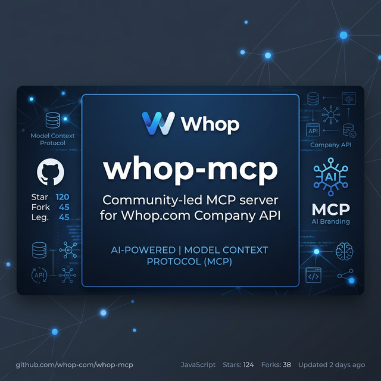

# whop-mcp

<div align="center">
  
  <br />
  <a href="https://www.npmjs.com/package/@furkankoykiran/whop-mcp">
    
  </a>
  <a href="https://www.npmjs.com/package/@furkankoykiran/whop-mcp">
    
  </a>
  <a href="https://github.com/furkankoykiran/whop-mcp/blob/main/LICENSE">
    
  </a>
</div>

A community-built **Model Context Protocol (MCP) server** for the [Whop.com](https://whop.com) Company API. It enables AI assistants (Claude, Cursor, etc.) to fully manage your Whop business — payments, memberships, products, promo codes, affiliates, and more.

## ✨ Features

- 🔐 Secure API key authentication via environment variable
- 📦 Full TypeScript with strict type-safety
- 🔄 Automatic retry & rate-limit handling
- 🛡️ Comprehensive error handling (401, 403, 404, 429)
- 🚀 Works with Claude Desktop, Cursor, and any MCP-compatible client
- 📡 stdio transport (works as a CLI binary or subprocess)

---

## ⚙️ Quick Start

### Install in VS Code
Install the whop-mcp server in VS Code with one click:

[](https://insiders.vscode.dev/redirect?url=vscode%3Amcp%2Finstall%3F%7B%22name%22%3A%22whop%22%2C%22command%22%3A%22npx%22%2C%22args%22%3A%5B%22-y%22%2C%22%40furkankoykiran%2Fwhop-mcp%22%5D%2C%22env%22%3A%7B%22WHOP_API_KEY%22%3A%22YOUR_WHOP_API_KEY_HERE%22%7D%7D)

> **Note:** Replace `YOUR_WHOP_API_KEY_HERE` with your actual Company API key from the Whop Developer Dashboard.

### Install in Claude Desktop
Add to your Claude Desktop config file:

**macOS/Linux**: `~/.config/claude/claude_desktop_config.json`  
**Windows**: `%APPDATA%\Claude\claude_desktop_config.json`

```json
{
  "mcpServers": {
    "whop": {
      "command": "npx",
      "args": ["-y", "@furkankoykiran/whop-mcp"],
      "env": {
        "WHOP_API_KEY": "YOUR_WHOP_API_KEY_HERE"
      }
    }
  }
}
```

### Install in Cursor
Add to your Cursor MCP settings (`Cursor Settings -> MCP Servers`):

```json
{
  "whop": {
    "command": "npx",
    "args": ["-y", "whop-mcp"],
    "env": {
      "WHOP_API_KEY": "YOUR_WHOP_API_KEY_HERE"
    }
  }
}
```

---

## 🔑 Getting Your API Key

1. Go to [https://whop.com/dashboard/developer](https://whop.com/dashboard/developer)
2. Click **Create** in the **Company API Keys** section
3. Give your key a name (e.g. "Claude Integration")
4. Select the appropriate permissions (Payments, Memberships, Products, etc.)
5. Copy the key — you'll never see it again!

---

## 💰 Available Tools

### 💰 Payments & Finance
| Tool | Description |
|------|-------------|
| `list_payments` | List payments with filters (status, product, date range, pagination) |
| `get_payment` | Get full details of a specific payment |
| `refund_payment` | Issue a full or partial refund for a payment |
| `retry_payment` | Retry a failed payment attempt |
| `void_payment` | Void an open/uncollected payment |
| `get_financial_summary` | High-level revenue, refund, and fee summary |

### 🪪 Memberships & Licenses
| Tool | Description |
|------|-------------|
| `list_memberships` | List memberships with filters (status, product, user, validity) |
| `get_membership` | Get full membership details including license key and expiry |
| `validate_license` | Validate a license key and check if its membership is active |
| `add_free_days` | Extend a membership by adding free days |
| `cancel_membership` | Cancel a membership at period end |
| `terminate_membership` | Immediately revoke a membership |
| `update_membership` | Update metadata on a membership |

### 📦 Products & Catalog
| Tool | Description |
|------|-------------|
| `list_products` | List all products with plans and experiences |
| `get_product` | Get full product details, plans, and experiences |
| `create_product` | Create a new product |
| `update_product` | Update product name, visibility, or description |
| `delete_product` | Delete a product permanently |
| `list_plans` | List all pricing plans for a product |

### 🎟️ Promo Codes & Discounts
| Tool | Description |
|------|-------------|
| `list_promo_codes` | List all promo codes with optional status filter |
| `get_promo_code` | Get details of a specific promo code |
| `create_promo_code` | Create a new discount code (% or $ off) |
| `update_promo_code` | Update an existing promo code (status, expiry, etc.) |
| `delete_promo_code` | Permanently delete a promo code |

### 🤝 Affiliates
| Tool | Description |
|------|-------------|
| `list_affiliates` | List all affiliates with commission and earnings data |
| `get_affiliate` | Get detailed stats for a specific affiliate |
| `get_affiliate_summary` | Aggregate affiliate program performance with top performers |

### 👥 Customers & Reviews
| Tool | Description |
|------|-------------|
| `get_user` | Look up a Whop user by username or user ID |
| `search_users_by_email` | Find customers by email address |
| `list_reviews` | Fetch customer reviews with optional star rating filter |
| `get_review_stats` | Aggregate review statistics (avg rating, distribution) |

---

## ▶️ Example Prompts

Once connected, you can ask your AI assistant:

- *"Show me all payments from the last 30 days"*
- *"Refund payment pay_123abc"*
- *"Add 7 free days to membership mem_456def"*
- *"Create a 20% off promo code called SUMMER20 that expires December 31, 2025"*
- *"What's my average customer review rating?"*
- *"Who are my top 5 affiliates by earnings?"*
- *"Validate license key ABC-1234-XYZ"*

---

## 🔧 Development

```bash
# Install deps
npm install

# Run in dev mode (auto-reload)
npm run dev

# Build
npm run build

# Test manually
echo '{"jsonrpc":"2.0","id":1,"method":"tools/list"}' | WHOP_API_KEY=test node dist/index.js
```

---

## 🤝 Contributing

Contributions are welcome! Please see [CONTRIBUTING.md](./CONTRIBUTING.md) for guidelines.

## 📄 License

This project is licensed under the [MIT License](./LICENSE).

---

> ⚠️ **Disclaimer:** This is a community-led project and is **NOT** an official Whop.com product. It is not affiliated with, endorsed by, or supported by Whop.com. Always test in a non-production environment before running actions like refunds or membership terminations.